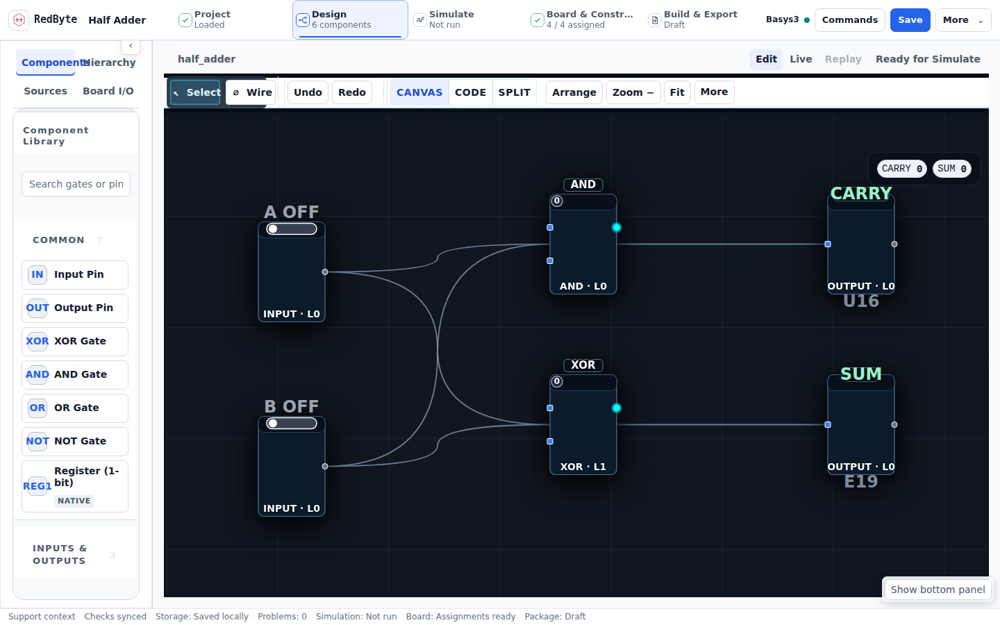

# RedByte

**Visual digital-logic engineering from circuit to FPGA handoff — a deterministic browser workbench for the Digilent Basys3.**



**Live:** [redbyteapps.dev](https://redbyteapps.dev) · **Open the IDE:** [redbyteapps.dev/os/](https://redbyteapps.dev/os/)

---

## What is RedByte?

RedByte is a browser-based engineering workbench for digital logic coursework. Students design circuits on a canvas-first workbench, simulate and observe behavior, assign signals to real Basys3 resources, and build a Vivado-ready engineering package — all in the browser, with the proof boundary kept explicit at every step.

RedByte does not replace Vivado. It prepares and proves browser-side project state; AMD Vivado 2024.2 owns synthesis, implementation, timing, and bitstream generation downstream, and the physical board owns observed hardware behavior.

---

## Five workspaces

One application shell, one project authority, five workspaces:

| Workspace | Purpose |
|-----------|---------|
| **Project** | Operating center: source explorer, live circuit overview, contextual next actions, recent projects, and recovery |
| **Design** | Canvas-first circuit authoring with a component library, reusable one-level modules with instances, Canvas/Code/Split views, contextual inspector, and inline Basys3 mapping |
| **Simulate** | Observe-first simulation: author scenarios, run, and inspect observed waveform truth; expected-output checks are optional and explicit; a testbench lens mirrors the packaged `testbench.vhd` |
| **Board & Constraints** | Table-first assignment of logical signals to Basys3 resources through one canonical mapping authority, with an interactive board reference and XDC preview |
| **Build & Export** | Vivado handoff manager: build, validate, inspect, and download the engineering package |

**Import / Recover** is a separate reviewed utility for opening RedByte packages, inspecting HDL/XDC, and restoring recovery checkpoints. It never silently replaces current work.

### Observe-first simulation

A simulation run records observed behavior even when zero checks are configured. Comparison is explicit: you create checks from observed values (or author them directly) only when you want formal pass/fail evidence. A zero-check run is *Simulated* — never silently trusted — and current passing checks are required before an export is treated as trusted.

---

## Key capabilities

- Deterministic tick-based simulation (topological evaluation, integer-only signals, no wall-clock or random state in verify/export paths)
- Combinational and supported sequential design: gates (2/3-input variants), Register (1-bit) with one clock domain, rising-edge capture, and active-high asynchronous reset
- Reusable modules: create a module from a selection, place instances, open definitions, and see elaborated `instance.internal` signal lanes in simulation
- Scenario authoring with waveform inspection, markers, per-event inspection, and check authoring from observed values
- Canonical Basys3 mapping (`SW*`, `LD*`, `BTN*`, `CLK100MHZ`) with conflict detection and XDC truth preview
- Deterministic 9-file Vivado handoff package: `top.vhd` (plus module sources), `top.xdc`, `testbench.vhd`, `vivado_import.tcl`, `program_and_test.tcl`, `EXPECTED_IO.json`, `project.rbproj.json`, `README.txt`, `BRINGUP.md`
- Golden-export gates keep the generated package byte-stable across environments

---

## Proof boundary

RedByte is honest about what the browser can prove:

| Tier | Claim | Owner |
|------|-------|-------|
| **E0** | The package was generated from the current project state | RedByte (browser) |
| **E1** | The design synthesizes and implements | AMD Vivado 2024.2 |
| **E2** | The bitstream programs the board | Vivado + Basys3 |
| **E3** | The physical board behaves as designed | Human observation |

A physical Basys3 (`xc7a35tcpg236-1`) is required for E2/E3. Browser evidence never claims hardware behavior.

---

## Quick start

Windows (double-click launcher):

```text
run.bat
```

From a terminal:

```bash
pnpm install
pnpm dev          # RedByte IDE at http://localhost:5173
```

Pinned runtime: Node 20.19.0 (`.nvmrc`) with pnpm 10.24.0 (`corepack pnpm`).

Other useful commands:

```bash
corepack pnpm build:unified        # Full production build (root doorway + /os IDE) into dist/
corepack pnpm start:production     # Build and preview the production bundle (Windows launcher)
```

---

## Vivado handoff

1. Finish the browser workflow through **Build & Export** and download the package ZIP.
2. Open AMD Vivado 2024.2 and source `vivado_import.tcl` to create the project.
3. Run synthesis and implementation, generate the bitstream, and program the Basys3.
4. Follow `BRINGUP.md` inside the package to observe and record physical behavior.

---

## Architecture summary

Monorepo using pnpm workspaces:

```
redbyte-ui-genesis/
├── apps/
│   └── playground/              # IDE host application (builds to /os)
├── packages/
│   ├── rb-apps/                 # IDE application: workspaces, workbench shell, surfaces
│   ├── rb-logic-core/           # Deterministic circuit simulation engine
│   ├── rb-logic-view/           # 2D circuit canvas
│   ├── rb-fpga-toolchain/       # VHDL/XDC/TCL package generation
│   ├── rb-board-profiles/       # Basys3 board/resource truth
│   ├── rb-primitives/, rb-tokens/, rb-theme/   # Shared UI + design tokens
│   └── ...
├── public/                      # Public doorway (start.html), headers, redirects, media
├── scripts/                     # Build, contract-test, and CI scripts
└── docs/                        # Documentation (see docs/DOC_INDEX.md)
```

Deployment: GitHub Actions builds `dist/` (`pnpm build:unified`) and deploys to Cloudflare Pages with `wrangler pages deploy` — `main` to production ([redbyteapps.dev](https://redbyteapps.dev)), product branches to previews. Every deploy is verified by comparing `/os/version.json` against the triggering commit SHA. See [DEPLOYMENT.md](./DEPLOYMENT.md).

**Technology:** React 19 · TypeScript 5 (strict) · Vite · Zustand · Vitest · Playwright.

---

## Documentation

| Entry point | Description |
|-------------|-------------|
| [docs/DOC_INDEX.md](./docs/DOC_INDEX.md) | Full documentation navigation hub |
| [docs/manuals/RedByte_Product_Manual.md](./docs/manuals/RedByte_Product_Manual.md) | Canonical product reference |
| [docs/course/STUDENT_QUICKSTART.md](./docs/course/STUDENT_QUICKSTART.md) | First-lab path for students |
| [docs/course/INSTRUCTOR_QUICKSTART.md](./docs/course/INSTRUCTOR_QUICKSTART.md) | Assignment setup and proof tiers |
| [docs/course/TA_TROUBLESHOOTING_GUIDE.md](./docs/course/TA_TROUBLESHOOTING_GUIDE.md) | Stage-by-stage triage |
| [docs/ARCHITECTURE.md](./docs/ARCHITECTURE.md) | Architecture layers |
| [docs/VIVADO_INTEGRATION.md](./docs/VIVADO_INTEGRATION.md) | Vivado export workflow and generated files |
| [docs/contracts/RedByte_Product_Contract.md](./docs/contracts/RedByte_Product_Contract.md) | Target-state contract |
| [docs/ACTIVE_WORK.md](./docs/ACTIVE_WORK.md) | Current work cockpit |

---

## Development

```bash
pnpm -w exec vitest run              # Run tests
corepack pnpm typecheck              # Workspace typecheck
corepack pnpm css:audit:ide          # IDE CSS ownership audit
corepack pnpm rb:doc:validate        # Canonical-doc validation
corepack pnpm rb:site:start:test     # Public doorway contract
corepack pnpm build:unified          # Production build + dist verification
```

Current suite baselines and known pre-existing failures are tracked in `AI_STATE.md`. CI runs fast checks on every PR and reserves the full classroom gate aggregate for `main` (see [CI_CONTRACT.md](./CI_CONTRACT.md)).

---

## License

**RedByte Proprietary License (RPL-1.0)** — no redistribution. Copyright 2025-2026 Connor Angiel.

---

## Contact

**Owner:** Connor Angiel
**Repository:** [github.com/swaggyp52/redbyte-ui-genesis](https://github.com/swaggyp52/redbyte-ui-genesis)
**Live:** [redbyteapps.dev](https://redbyteapps.dev)
