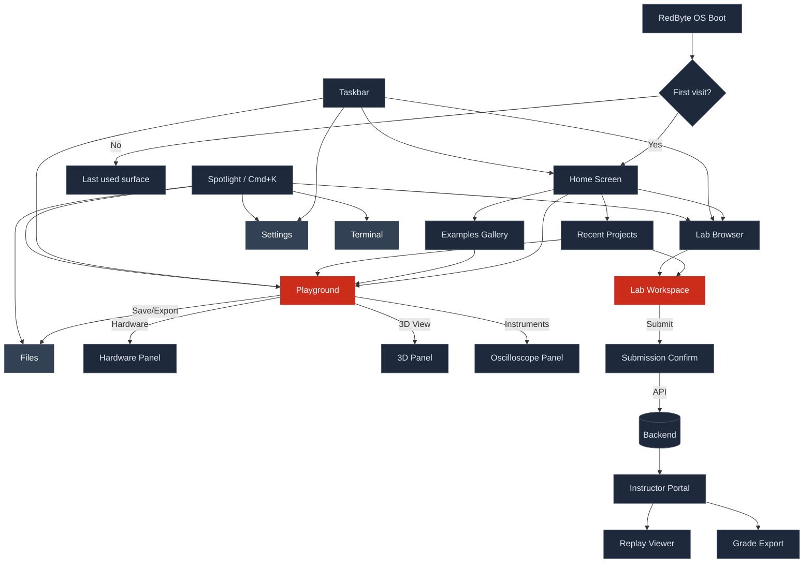
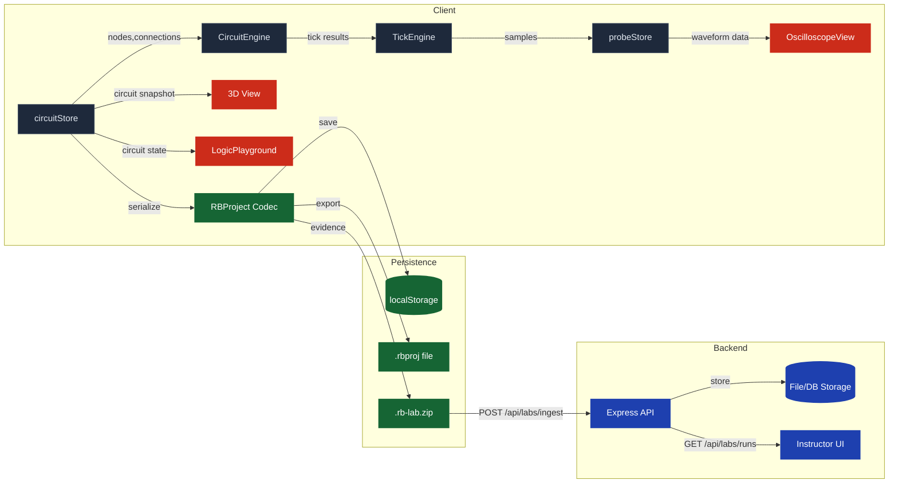

# RedByte 2.0 — Complete Redesign + Partial Rewrite Specification

> **Status**: Draft v1.0
> **Date**: 2026-02-06
> **Author**: Lead Engineer (Claude) for Connor Angiel
> **Scope**: Ground-up UX redesign + targeted rewrite plan turning RedByte from "a cool jumble of apps" into a coherent OS-grade education platform.

---

## Table of Contents

- [A. Product Spec](#a-product-spec)
- [B. Information Architecture](#b-information-architecture)
- [C. UX Redesign](#c-ux-redesign)
- [D. Workflow Redesign](#d-workflow-redesign)
- [E. Backend Spec](#e-backend-spec)
- [F. Phased Rewrite Plan](#f-phased-rewrite-plan)
- [G. Hard UX Acceptance Tests](#g-hard-ux-acceptance-tests)
- [H. No-More-Jumble Invariants](#h-no-more-jumble-invariants)

---

## A. Product Spec

### A.1 What RedByte Is

RedByte is a **browser-based engineering OS for digital logic education**. It provides students with a desktop-metaphor environment where they can:

1. **Build** combinational and sequential circuits from a component palette
2. **Simulate** those circuits with a deterministic tick-based engine
3. **Analyze** runtime behavior via probes, oscilloscope, and timing views
4. **Visualize** circuits in 3D (read-only subscriber to 2D state)
5. **Flash** designs to real hardware (Basys3 FPGA, Arduino) via a bridge
6. **Submit** evidence capsules (`.rb-lab.zip`) containing deterministic proof of work

It is **not** a general-purpose operating system. The "OS" metaphor (windows, taskbar, filesystem, launcher) exists to provide a familiar navigational shell around a focused set of engineering tools.

### A.2 Personas

| Persona | Role | Goals | Key Frustrations |
|---------|------|-------|-----------------|
| **Student (Primary)** | ECE 200/300/400 undergrad | Build circuits for homework, run lab assignments, submit evidence | "Where do I even start?", too many apps, can't tell playground from lab |
| **Instructor** | ECE professor/TA | Assign labs, review submissions, configure CE mode | Needs admin dashboard, roster management, deadline enforcement |
| **Explorer** | Self-learner, hobbyist | Play with logic gates, learn digital design | Wants zero friction: open → build → see it work |
| **Admin** | IT / course coordinator | Deploy, manage auth, monitor health | Needs SSO integration, audit logs, uptime guarantees |

**Primary design target**: The Student who has never used RedByte before and needs to complete a lab assignment by Friday.

### A.3 Modes of Operation

| Mode | Trigger | Behavior |
|------|---------|----------|
| **Studio Mode** (default) | `pnpm run dev` with no flags | Full access to all tools. No guardrails. Authoring-first. |
| **Classroom Edition (CE)** | `?ce=1` or `VITE_CLASSROOM=true` | Guardrails active: 20-node cap, auto-degrade at 15, example gallery, help overlay on `?`, autosave forced on. Simplified UI. |
| **Student Mode** | `?student=1` or instructor-set | Hides Playground and ECE Lab from taskbar (only Labs app visible). Prevents free exploration outside assigned work. |
| **Replay Mode** | Opened from evidence capsule or recording | Circuit is read-only. Playback controls visible. No editing. |

**Design principle**: Studio mode is the **default and complete** experience. CE and Student modes are *subtractive* — they remove features, never add invisible ones.

### A.4 Object Model

```
RBProject (canonical)
├── metadata: { name, version, created, modified, author }
├── circuit: CircuitData
│   ├── nodes: CircuitNode[]        // Gate instances with type, position, label
│   ├── connections: Connection[]    // Port-to-port wires
│   └── composites: Composite[]     // User-defined sub-circuits (RSLatch, FullAdder, etc.)
├── probes: ProbeConfig[]           // Attached probe definitions
├── simulation: SimulationState
│   ├── tickRate: number
│   ├── isRunning: boolean
│   └── history: TickSnapshot[]
├── layout: LayoutPreference         // Which panels are open, camera position
└── exports: ExportArtifacts?       // Netlist, Verilog, debug bundle
```

**Evidence Capsule** (`.rb-lab.zip`):
```
evidence-capsule/
├── manifest.json        // Lab ID, student ID, run UUID, timestamps
├── circuit.rbproj       // Frozen project state at submission
├── golden.sha256        // Deterministic hash of simulation output
├── vectors.csv          // Input vectors applied
├── results.csv          // Output values captured
├── recording.bin?       // Optional: full tick-by-tick replay data
└── screenshots/         // Optional: captured views
```

### A.5 Happy Paths

#### Happy Path 1: Explorer (Zero-to-Blinking-LED)
```
1. Navigate to redbyte.dev
2. See Welcome screen → click "Open Playground"
3. Playground opens with blank canvas
4. Drag Clock + AND gate + LED from palette
5. Wire Clock → AND.A, toggle switch → AND.B, AND.Out → LED
6. Click ▶ Run — LED blinks when switch is on
7. Open oscilloscope — see waveform
8. Save as "my-first-circuit.rbproj"
```
**Target time**: Under 90 seconds from load to blinking LED.

#### Happy Path 2: Student (Lab Completion)
```
1. Navigate to redbyte.dev/?ce=1
2. See Welcome → click "Open Labs"
3. Labs list shows "ECE 347 Lab 3: Full Adder"
4. Click lab → Lab workspace opens with:
   - Instructions panel (left)
   - Circuit canvas (center)
   - Test vectors panel (right)
5. Build full adder circuit following instructions
6. Click "Run Vectors" → all pass ✓
7. Click "Submit" → evidence capsule generated + uploaded
8. See confirmation: "Lab 3 submitted successfully"
```
**Target time**: Under 60 seconds from load to seeing instructions.

#### Happy Path 3: Instructor (Review Submission)
```
1. Navigate to redbyte.dev/admin
2. Log in with institutional SSO
3. Dashboard shows: Lab 3 — 24/30 submitted
4. Click student name → evidence capsule opens in Replay mode
5. See their circuit, re-run vectors, verify golden hash
6. Assign grade, leave feedback
7. Export grades as CSV
```

### A.6 What RedByte Is NOT

- Not a SPICE simulator (no analog simulation beyond basic signal levels)
- Not a PCB layout tool (no physical design)
- Not an IDE (no code editing beyond Verilog export)
- Not a general-purpose OS (the desktop metaphor is navigational, not functional)

---

## B. Information Architecture

### B.1 Current State: The Jumble

Today, RedByte registers **24 apps** at full boot:

| # | App | Category | Purpose | Problem |
|---|-----|----------|---------|---------|
| 1 | Launcher | system | App grid / Spotlight search | Fine |
| 2 | Settings | system | Theme, display, keyboard shortcuts | Fine |
| 3 | Files | system | Virtual filesystem browser | Functional but orphaned |
| 4 | Terminal | system | Command-line interface | Developer-only |
| 5 | SystemLog | system | Event log viewer | Developer-only |
| 6 | StatusPanel | system | System status display | Developer-only |
| 7 | Welcome | system | First-run onboarding | Only appears once |
| 8 | StartHere | system | Getting-started guide | Duplicates Welcome purpose |
| 9 | TextViewer | tools | Plain text file viewer | Utility |
| 10 | AppStore | tools | Browse installable apps | Empty / aspirational |
| 11 | **LogicPlayground** | **logic** | **2D circuit sandbox** | **Core surface — but name is confusing vs Lab** |
| 12 | **ECELab** | **logic** | **2D guided lab with vectors** | **Core surface — but hidden in Student mode** |
| 13 | **LabsApp** | **logic** | **Lab assignment browser** | **Entry point to labs — but separate from ECELab** |
| 14 | VirtualLab | logic | Virtual lab environment | Unclear overlap with ECELab |
| 15 | LabWorkspace | logic | Unified lab engine (WIP) | RB_UNIFY experiment |
| 16 | LogicHelp | tools | Context-sensitive circuit help | Should be panel, not app |
| 17 | UserManual | tools | Full user documentation | Should be panel, not app |
| 18 | HelpAppManifest | tools | Help system entry | Redundant with LogicHelp |
| 19 | HardwarePanel | tools | FPGA/Arduino connection UI | Should be panel in Playground |
| 20 | FpgaProofViewer | tools | View FPGA proof data | Niche utility |
| 21 | LabExaminer | tools | Evidence capsule inspector | Instructor tool |
| 22 | Instructor | tools | Instructor dashboard | Instructor tool |
| 23 | InstructorRunDetail | tools | Single run deep-dive | Sub-view of Instructor |
| 24 | SubmissionInspector | tools | Submission analysis | Overlaps with LabExaminer |

**Diagnosis**: 24 apps for what should be **3 experiences** (Playground, Lab, Admin) with auxiliary panels.

### B.2 Redesigned Surface Map

```
RedByte OS Shell
├── 🏠 Home (Welcome + Start Here → merged)
│   ├── "New Circuit" → opens Playground
│   ├── "My Labs" → opens Lab Browser
│   ├── "Recent Projects" → quick access list
│   └── "Examples" → opens Playground with example loaded
│
├── 🔧 Playground (LogicPlayground — the core)
│   ├── Canvas (2D circuit editor)
│   ├── Palette (component browser, drag/click to place)
│   ├── Toolbar (project, sim controls, perspective, layout presets)
│   ├── [Panel] Oscilloscope / Timing View
│   ├── [Panel] 3D View (read-only subscriber)
│   ├── [Panel] Probes / Instruments
│   ├── [Panel] Info (node details, truth table, learn)
│   ├── [Panel] Hardware Bridge (FPGA/Arduino connect + flash)
│   └── [Panel] Help (context-sensitive, user manual)
│
├── 📋 Labs (ECELab + LabsApp → merged)
│   ├── Lab Browser (assignment list with status)
│   ├── Lab Workspace (instructions + canvas + vectors)
│   ├── Submission (evidence export + upload)
│   └── [inherits all Playground panels]
│
├── 👩‍🏫 Instructor Portal (Instructor + LabExaminer + SubmissionInspector → merged)
│   ├── Dashboard (class overview, submission stats)
│   ├── Roster (student list, progress tracking)
│   ├── Run Viewer (evidence replay, golden hash verification)
│   └── Grades (grade assignment, CSV export)
│
├── ⚙️ System (always available)
│   ├── Settings (theme, keyboard shortcuts, display)
│   ├── Files (virtual filesystem)
│   └── Terminal (developer/power-user only)
│
└── [Removed / Absorbed]
    ├── AppStore → removed (no marketplace needed for v1)
    ├── SystemLog → Settings > Advanced > Logs
    ├── StatusPanel → Settings > Advanced > Status
    ├── StartHere → merged into Home
    ├── Welcome → merged into Home
    ├── TextViewer → opens in-line (no separate app)
    ├── VirtualLab → absorbed into Labs
    ├── LabWorkspace → absorbed into Labs
    ├── LogicHelp → Playground Help panel
    ├── UserManual → Playground Help panel
    ├── HelpAppManifest → removed
    ├── HardwarePanel → Playground Hardware panel
    ├── FpgaProofViewer → Instructor Portal > Run Viewer
    ├── InstructorRunDetail → Instructor Portal > Run Viewer
    └── SubmissionInspector → Instructor Portal
```

**Result**: 24 apps → **4 experiences** (Home, Playground, Labs, Instructor) + 2 system utilities (Settings, Files) + 1 dev tool (Terminal). Total: **7 navigable entries**.

### B.3 Navigation Flow (Mermaid)



### B.4 Data Flow



---

## C. UX Redesign

### C.1 Design Philosophy

**RedByte should look and feel like a professional engineering tool that happens to be friendly enough for undergrads.** Not a toy, not enterprise gray. Think "VS Code meets Figma with engineering aesthetics."

Core principles:
1. **Clarity over decoration** — Every pixel communicates function
2. **Dark-first, high contrast** — Engineers work in dark rooms; circuits need contrast to read
3. **Monospace-forward** — Signal values, port labels, and data are mono; UI chrome is sans
4. **Red as accent, not alarm** — The `#cc2c1a` RedByte red is identity, not danger. Reserve red for actual errors.
5. **Dense but not cluttered** — Information-rich panels with clear visual hierarchy

### C.2 Theme Architecture (Redesigned)

The current `rb-theme` package has a minimal `ThemeTokenSet` (5 tailwind class strings). The `rb-tokens` package has a comprehensive `RBTokens` type with full color scales, typography, spacing, motion — but it's not wired to the UI consistently.

**Redesign**: Merge into a single token-driven system.

#### Token Schema

```typescript
interface RedByteTheme {
  id: string;
  name: string;

  // Semantic colors (not scales — resolved values)
  color: {
    // Surfaces
    bgBase: string;         // App background
    bgElevated: string;     // Panels, cards, popovers
    bgOverlay: string;      // Modals, dropdowns
    bgCanvas: string;       // Circuit canvas background
    bgInset: string;        // Recessed areas (input fields, code blocks)

    // Borders
    borderDefault: string;  // Standard dividers
    borderSubtle: string;   // Low-contrast dividers
    borderFocus: string;    // Focus rings

    // Text
    textPrimary: string;    // Body text
    textSecondary: string;  // Labels, descriptions
    textMuted: string;      // Placeholders, disabled
    textOnAccent: string;   // Text on accent-colored backgrounds

    // Accent (RedByte red)
    accent: string;         // Primary accent (#cc2c1a in dark-neon)
    accentHover: string;    // Accent hover state
    accentMuted: string;    // Subtle accent backgrounds

    // Semantic
    success: string;
    warning: string;
    error: string;
    info: string;

    // Circuit-specific
    wireActive: string;     // Wire carrying HIGH signal
    wireInactive: string;   // Wire carrying LOW signal
    wireFloating: string;   // Unconnected wire
    nodeStroke: string;     // Gate/component border
    nodeFill: string;       // Gate/component fill
    portInput: string;      // Input port indicator
    portOutput: string;     // Output port indicator
    selectionRing: string;  // Selected node highlight
    gridLine: string;       // Canvas grid
    gridDot: string;        // Canvas grid dots
  };

  // Typography
  font: {
    sans: string;           // "Space Grotesk", system fallbacks
    mono: string;           // "JetBrains Mono", system fallbacks

    // Preset sizes
    display: { size: string; weight: string; lineHeight: string; tracking: string };
    heading: { size: string; weight: string; lineHeight: string; tracking: string };
    subheading: { size: string; weight: string; lineHeight: string; tracking: string };
    body: { size: string; weight: string; lineHeight: string; tracking: string };
    caption: { size: string; weight: string; lineHeight: string; tracking: string };
    code: { size: string; weight: string; lineHeight: string; tracking: string };
    label: { size: string; weight: string; lineHeight: string; tracking: string };
  };

  // Spacing (4px grid)
  space: Record<0 | 1 | 2 | 3 | 4 | 5 | 6 | 8 | 10 | 12 | 16 | 20 | 24 | 32, string>;

  // Radii
  radius: {
    none: string;
    sm: string;    // 2px — buttons, inputs
    md: string;    // 4px — cards, panels
    lg: string;    // 8px — modals, popovers
    full: string;  // pill shapes
  };

  // Shadows
  shadow: {
    sm: string;    // Subtle lift (buttons)
    md: string;    // Cards, panels
    lg: string;    // Modals, popovers
    glow: string;  // Accent glow for active/focused elements
  };

  // Motion
  motion: {
    fast: string;     // 100ms — hover, toggle
    normal: string;   // 200ms — panel open, tab switch
    slow: string;     // 350ms — modal open, page transition
    easing: string;   // cubic-bezier(0.4, 0, 0.2, 1)
  };
}
```

#### Shipped Themes

| Theme | Background | Accent | Character |
|-------|-----------|--------|-----------|
| **Dark Neon** (default) | `#0f172a` (slate-950) | `#cc2c1a` (RedByte red) | Cyberpunk engineering — dark canvas, high-contrast wires, neon-red accents |
| **Light Frost** | `#f8fafc` (slate-50) | `#d97706` (amber-600) | Clean daylight mode — crisp lines, warm amber accents |
| **Midnight** | `#020617` (slate-950 deeper) | `#6366f1` (indigo-500) | Deep blue-black — for late-night lab sessions |

### C.3 Typography

```
DISPLAY:    Space Grotesk 600  2.25rem/1.1  -0.025em   — App titles, hero text
HEADING:    Space Grotesk 600  1.25rem/1.2  -0.015em   — Panel titles, section headers
SUBHEADING: Space Grotesk 500  0.875rem/1.3  0.02em    — Toolbar labels, tab titles
BODY:       Space Grotesk 400  0.875rem/1.5  0          — Descriptions, instructions
CAPTION:    Space Grotesk 400  0.75rem/1.4   0.01em    — Timestamps, metadata, status
CODE:       JetBrains Mono 400 0.8125rem/1.5  0         — Signal values, port labels, hex addresses
LABEL:      Space Grotesk 500  0.6875rem/1.0  0.06em   — ALL-CAPS micro labels (INPUTS, OUTPUTS)
```

**Rules**:
- All signal/data values use `CODE` (mono). Always.
- UI chrome uses `BODY`/`SUBHEADING`/`HEADING` (sans).
- Never mix: a component's port label is mono, but the component's name in the palette is sans.
- Minimum font size: 11px. Nothing smaller on any screen.

### C.4 Component Strategy

Redesign creates a focused component library in `rb-primitives`:

#### Foundation Components
| Component | Purpose |
|-----------|---------|
| `Button` | Primary (accent fill), secondary (outline), ghost (no border), danger (error fill) |
| `IconButton` | Square, icon-only, with tooltip |
| `Input` | Text input with label, error state, mono variant for values |
| `Select` | Dropdown with search for long lists |
| `Toggle` | Binary on/off switch |
| `Slider` | Range input (tick rate, zoom) |
| `Tabs` | Panel tab bar with icon + label |
| `Badge` | Status indicators (running, paused, error, submitted) |
| `Tooltip` | Contextual hover info |
| `Modal` | Centered overlay with backdrop |
| `Popover` | Anchored floating content |
| `Toast` | Transient notifications (bottom-right) |

#### Layout Components
| Component | Purpose |
|-----------|---------|
| `Panel` | Resizable panel with header, collapse, drag handle |
| `PanelGroup` | Flex container for panels with drag dividers |
| `Toolbar` | Horizontal bar with grouped actions |
| `Sidebar` | Collapsible side panel (palette, instructions) |
| `StatusBar` | Bottom bar with simulation status + metadata |
| `CommandPalette` | Spotlight-style search (Cmd+K) |

#### Circuit Components (in `rb-logic-view`)
| Component | Purpose |
|-----------|---------|
| `CircuitCanvas` | Main SVG/Canvas rendering surface |
| `GateNode` | Individual gate/component visual |
| `Wire` | Connection line with signal color |
| `Port` | Input/output port indicator |
| `SelectionBox` | Multi-select rubber-band |
| `MiniMap` | Overview navigator |

### C.5 Iconography

Use a single icon system. Currently there appear to be mixed sources. Standardize on:
- **Lucide** for UI chrome (settings gear, close X, chevrons, file icons)
- **Custom SVG** for circuit components (AND, OR, NOT, NAND, XOR, etc.) — these already exist in the gate rendering
- Icon size: 16px in toolbars, 20px in panels, 24px in empty states

### C.6 Grid and Layout System

- **4px base grid** — all spacing is multiples of 4px
- **Panel minimum widths**: 200px (collapsed sidebar), 320px (palette), 400px (canvas)
- **Canvas grid snap**: 20px (current) — keep for circuit alignment
- **Responsive breakpoints**: Not relevant (RedByte is desktop-only, minimum 1280×720)
- **Layout presets**: Build (palette+canvas+info), Analyze (canvas+scope+probes), Quad (2×2), Circuit-only, Scope-only, 3D-only

---

## D. Workflow Redesign

### D.1 Boot + Onboarding

#### Current Problems
- `WelcomeWindow` appears once, offers "Explore Studio" and "Open Playground" — neither term explains what they do
- `StartHereApp` is a separate app that duplicates the purpose
- After dismissing Welcome, there's no persistent "home" — user is dropped at the desktop with a taskbar

#### Redesigned Flow

```
BOOT
├── First visit (no localStorage flag)
│   └── HOME SCREEN (full-bleed, replaces desktop)
│       ├── Hero: "Welcome to RedByte" + 10-second looping animation of a circuit being built
│       ├── Primary CTA: "New Circuit" (opens Playground with blank canvas)
│       ├── Secondary CTA: "Browse Examples" (opens Playground with example picker)
│       ├── If CE mode: "My Labs" button (opens Lab Browser)
│       └── Footer: "Settings" | "Help" | "What's New"
│
├── Returning visit
│   └── LAST SESSION RESTORED
│       ├── If autosave exists → Playground opens with last circuit restored
│       ├── If lab was in-progress → Lab Workspace opens at last state
│       └── If nothing → HOME SCREEN (persists as default)
│
└── CE Mode first visit
    └── HOME SCREEN (CE variant)
        ├── Hero: "Welcome to [Course Name]" (configurable)
        ├── Primary CTA: "My Labs" (opens Lab Browser)
        ├── Secondary CTA: "Practice in Playground"
        └── No "Explore Studio" — students don't need studio framing
```

**Key change**: Home is always accessible via taskbar (leftmost icon). It's not a one-time popup.

### D.2 Playground Workflow

The Playground is the **core authoring surface**. It should feel as immediate as opening a text editor.

#### Toolbar Redesign

Current `TopCommandBar` has: Project (New/Open/Save/Export/Examples), Simulation (Run/Pause/Step/Reset), tick rate slider, perspective switcher (Build/Analyze/Explain/Explore/Quad/etc.), help.

**Redesigned toolbar** (left to right):

```
┌─────────────────────────────────────────────────────────────────────────────┐
│ [≡] [New] [Open] [Save]  │  [▶ Run] [⏸] [→ Step] [⟲ Reset] [60 Hz ▾]  │  [Build ▾] │  [?]  │
│  ↑                        │           Simulation                          │  Layout    │  Help │
│  Menu (Export,            │                                               │  Preset    │       │
│  Settings, etc.)          │                                               │            │       │
└─────────────────────────────────────────────────────────────────────────────┘
```

**Changes**:
- Hamburger menu (≡) absorbs: Export, Import, Recent, Settings shortcut, About
- Sim controls get keyboard shortcuts displayed on hover: Space=Run/Pause, S=Step, R=Reset
- Layout preset dropdown replaces the long row of perspective buttons
- Help (?) opens help panel, not a separate app

#### Palette Redesign

Current `EnhancedPalette` has: search, favorites, recent, categories with drag-and-drop + click-to-place.

**Keep it.** The palette is already well-designed. Changes:
1. **Pin to left sidebar** — always visible in Build layout, collapsible via toggle
2. **Add keyboard shortcut hints** — hovering over a component shows "Drag or click to place"
3. **Remove "Favorites"** — premature feature for v1. Recent is enough.
4. **Category icons** — Basic I/O (⊞), Logic Gates (⊕), Timing (⏱), Analog (∿), Composites (◫)

#### Canvas Interactions

Already solid. Key refinements:
- **Snap to grid**: keep 20px default
- **Ctrl+scroll zoom**: already works
- **Middle-click pan**: already works
- **Double-click node**: open inline editor (label, delay, initial state)
- **Right-click context menu**: Cut, Copy, Paste, Delete, Rotate, Flip, Add Probe, View Truth Table
- **Ctrl+A**: Select all
- **Ctrl+Z/Y**: Undo/redo (already works via circuitStore history)
- **Delete key**: Delete selected (already works)

### D.3 Lab Workflow

#### Current Problems
- `LabsApp` (lab browser) and `ECELabApp` (lab workspace) are separate apps
- Student has to navigate between them
- Lab content is hardcoded or loaded from local definitions
- Submission flow works but has no confirmation UX

#### Redesigned Flow

Merge into a single **Labs** experience:

```
LABS (single app)
├── BROWSE view (default)
│   ├── Lab list: cards with title, due date, status badge (Not Started / In Progress / Submitted / Graded)
│   ├── Filter by: course, status, due date
│   └── Click card → opens WORKSPACE view
│
├── WORKSPACE view
│   ├── LEFT: Instructions panel (markdown rendered, scrollable, step highlighting)
│   ├── CENTER: Circuit canvas (inherits full Playground canvas capabilities)
│   ├── RIGHT: Test Vectors panel
│   │   ├── Vector table: inputs → expected outputs → actual outputs → pass/fail
│   │   ├── "Run All Vectors" button
│   │   └── Progress bar: 14/20 vectors passing
│   ├── BOTTOM: Status bar showing: Lab name | Due date | Time spent | Vector score
│   └── TOP: Toolbar (same as Playground but with Submit button added)
│
├── SUBMIT flow
│   ├── Click "Submit" → modal:
│   │   ├── "Your evidence capsule will include:"
│   │   ├── - Circuit state (X nodes, Y connections)
│   │   ├── - Test results (14/20 vectors passing)
│   │   ├── - Golden hash: abc123...
│   │   ├── [Submit] [Cancel]
│   │   └── Note: "You can resubmit until the deadline"
│   ├── On submit → POST to /api/labs/ingest
│   └── Confirmation: "Lab 3 submitted ✓" toast + status badge updated
│
└── REVIEW view (post-submission)
    ├── Read-only circuit view (replay mode)
    ├── Vector results table
    └── Grade + instructor feedback (when available)
```

### D.4 3D View Workflow

The 3D view is a **read-only subscriber** to the 2D circuit state. It should be a panel within Playground, not a separate app.

```
PLAYGROUND
├── Layout preset: "Explore" → canvas (60%) + 3D panel (40%)
├── 3D panel:
│   ├── Renders circuit as 3D components on a virtual breadboard
│   ├── Camera: orbit (drag), zoom (scroll), pan (shift+drag)
│   ├── Signal visualization: glowing wires for HIGH, dim for LOW
│   ├── Click component in 3D → selects in 2D canvas (bidirectional)
│   └── Toolbar: Reset camera, Toggle signal glow, Screenshot
└── Real-time sync: changes in 2D immediately reflected in 3D
```

### D.5 Hardware Bridge Workflow

```
PLAYGROUND → Hardware Panel (right sidebar)
├── CONNECTION
│   ├── Board selector: [Basys3 FPGA] [Arduino] [Simulation]
│   ├── Status: "Not connected" / "Connected via USB" / "Connected via WebSocket"
│   ├── [Connect] button → starts bridge discovery
│   └── Port assignment: map circuit I/O to board pins
│
├── PROGRAM FLOW
│   ├── [Synthesize] → generates bitstream from circuit
│   │   └── Progress: "Synthesizing... → Place & Route... → Bitstream ready"
│   ├── [Flash] → uploads bitstream to board
│   │   └── Progress: "Programming... → Verifying... → Done ✓"
│   └── [Live Monitor] → shows real-time I/O from board alongside simulation
│
└── PROOF CAPTURE
    ├── After hardware run, capture hardware evidence
    ├── Include in evidence capsule if in Lab mode
    └── Compare: simulation output vs hardware output (diff view)
```

---

## E. Backend Spec

### E.1 Current State

`api/server.mjs` has 4 endpoints with Bearer token auth, 10MB body limit, 30s timeout:

| Method | Path | Purpose | Status |
|--------|------|---------|--------|
| POST | `/api/labs/ingest` | Upload evidence capsule | Working |
| GET | `/api/labs/runs` | List all runs | Working |
| GET | `/api/labs/runs/:id` | Get single run detail | Working |
| POST | `/api/labs/diff` | Compare two runs | Working |

**Problems**:
- Single hardcoded Bearer token (no per-user auth)
- File-based storage (no database)
- No student identity (capsule contains self-reported data)
- No deadline enforcement
- No roster management
- No grade storage
- CORS is `*` (open to all origins)

### E.2 Redesigned API

#### Authentication

| Phase | Auth Method | Details |
|-------|------------|---------|
| **v1.0** (now) | Bearer token per course section | Token in `.env`, distributed by instructor. Simple but functional. |
| **v1.1** | LTI 1.3 integration | University LMS (Canvas, Blackboard) handles auth. RedByte is an LTI tool. |
| **v2.0** | SSO (SAML/OIDC) | Direct institutional SSO for standalone deployment. |

#### Endpoints (v1.0 target)

```
# === Submission Pipeline ===

POST   /api/labs/submit
       Auth: Bearer <course-token>
       Body: multipart/form-data { capsule: .rb-lab.zip, studentId: string, labId: string }
       Response: { runId: string, timestamp: string, status: "accepted" }
       Validation:
         - Capsule must be valid ZIP with required manifest.json
         - Golden hash must match re-computed hash (tamper detection)
         - File size < 10MB
         - labId must exist in course config
         - Reject if past deadline (unless grace period configured)

GET    /api/labs/submissions
       Auth: Bearer <course-token>
       Query: ?labId=&studentId=&status=&limit=&offset=
       Response: { submissions: Submission[], total: number }

GET    /api/labs/submissions/:runId
       Auth: Bearer <course-token>
       Response: { submission: SubmissionDetail, capsuleUrl: string }

POST   /api/labs/submissions/:runId/grade
       Auth: Bearer <instructor-token>
       Body: { grade: number, feedback: string, rubricScores?: Record<string, number> }
       Response: { updated: true }

# === Lab Configuration ===

GET    /api/labs
       Auth: Bearer <course-token>
       Response: { labs: LabDefinition[] }
       Returns: all labs for this course section with deadlines, vector sets, instructions

GET    /api/labs/:labId
       Auth: Bearer <course-token>
       Response: { lab: LabDefinition }

POST   /api/labs
       Auth: Bearer <instructor-token>
       Body: { LabDefinition }
       Creates a new lab assignment

PUT    /api/labs/:labId
       Auth: Bearer <instructor-token>
       Body: { partial LabDefinition }
       Updates lab configuration (deadline, vectors, instructions)

# === Course Management ===

GET    /api/courses
       Auth: Bearer <admin-token>
       Response: { courses: Course[] }

POST   /api/courses
       Auth: Bearer <admin-token>
       Body: { name, section, term, instructorToken, studentToken }

GET    /api/courses/:courseId/roster
       Auth: Bearer <instructor-token>
       Response: { students: Student[] }

POST   /api/courses/:courseId/roster
       Auth: Bearer <instructor-token>
       Body: { students: [{id, name, email}] }
       Bulk import roster (CSV upload on frontend)

# === Health ===

GET    /api/health
       Auth: none
       Response: { status: "ok", version: string, uptime: number }
```

#### Data Models

```typescript
interface LabDefinition {
  id: string;
  courseId: string;
  title: string;
  description: string;          // Markdown
  instructions: string;         // Markdown (step-by-step)
  dueDate: string;              // ISO 8601
  gracePeriodMinutes: number;   // Default: 0
  vectors: TestVector[];
  expectedOutputs: ExpectedOutput[];
  goldenCircuitHash?: string;   // Optional reference solution hash
  maxSubmissions: number;       // Default: unlimited (-1)
  status: 'draft' | 'published' | 'closed';
}

interface Submission {
  runId: string;                // UUID
  studentId: string;
  labId: string;
  courseId: string;
  timestamp: string;            // ISO 8601
  goldenHash: string;           // SHA-256 of simulation output
  vectorScore: { passed: number; total: number };
  capsulePath: string;          // Server-side storage path
  status: 'accepted' | 'late' | 'rejected' | 'graded';
  grade?: number;
  feedback?: string;
}

interface Course {
  id: string;
  name: string;                 // "ECE 347"
  section: string;              // "Fall 2026 Section 001"
  term: string;                 // "Fall 2026"
  instructorToken: string;      // Hashed
  studentToken: string;         // Hashed
  config: {
    ceMode: boolean;
    nodeLimit: number;
    allowedComponents: string[];  // Restrict palette in CE mode
  };
}
```

#### Storage (v1.0)

```
data/
├── courses/
│   └── {courseId}/
│       ├── config.json
│       ├── roster.json
│       └── labs/
│           └── {labId}/
│               ├── definition.json
│               └── submissions/
│                   └── {runId}/
│                       ├── meta.json
│                       └── capsule.rb-lab.zip
```

**v1.1 migration path**: Replace file-based storage with SQLite (via `better-sqlite3`). Same API contract, different persistence layer.

---

## F. Phased Rewrite Plan

### Phase 0: Foundation (Current Sprint)

**Goal**: Make the existing app usable as-is. No rewrites. Fix what's broken.

| Task | Status | Details |
|------|--------|---------|
| Fix 20-node hard limit | ✅ Done | CE: 20, Normal: 500 |
| Fix auto-degrade in normal mode | ✅ Done | CE-only now |
| Fix click-to-place stacking | ✅ Done | Smart spawn at camera center |
| Verify blank circuit → build → simulate → save works | ⬜ Manual test | End-to-end happy path |
| Fix p4-workflow-gates.yml (pnpm version + YAML error) | ⬜ | Line 46: `echo:` → `echo` |
| Fix build-hijack race condition on Windows | ⬜ | `build-hijack.mjs` triggers recursive builds |

### Phase 1: Surface Consolidation

**Goal**: Go from 24 apps to 7 navigable entries. No new features — just merge and redirect.

| Task | Deliverable | Acceptance Test |
|------|-------------|-----------------|
| Merge Welcome + StartHere → Home | New `HomeApp` component | First visit shows Home; Home accessible from taskbar |
| Merge LabsApp + ECELabApp → Labs | Unified `LabsApp` with browse/workspace views | Can browse labs and open workspace without app-switching |
| Merge LogicHelp + UserManual + HelpAppManifest → Help Panel | Panel in Playground right dock | Press `?` → help panel opens in-situ |
| Merge HardwarePanel → Playground panel | Panel in Playground right dock | Hardware connect/flash works from Playground panel |
| Merge Instructor + LabExaminer + SubmissionInspector + InstructorRunDetail → Instructor Portal | Unified `InstructorApp` | Can view submissions, replay evidence, assign grades |
| Remove AppStore, absorb SystemLog/StatusPanel into Settings | Settings > Advanced | No orphaned/empty apps |
| Update Taskbar PINNED_APPS | Home, Playground, Labs, Settings | 4 pinned items (Terminal available via Launcher) |
| Remove `studentHidden` flag | studentMode hides via route/CE config, not per-app flag | No apps are individually hidden; mode controls what's shown |

### Phase 2: UX Polish

**Goal**: Apply the redesigned theme, typography, and component library.

| Task | Deliverable | Acceptance Test |
|------|-------------|-----------------|
| Implement `RedByteTheme` token schema | `rb-tokens` v2 with semantic tokens | All colors/spacing/typography resolve from single theme object |
| Wire tokens to CSS variables | `applyTheme()` generates `--rb-*` CSS vars | Changing theme swaps all visuals without page reload |
| Ship Dark Neon, Light Frost, Midnight themes | 3 complete token sets | All 3 themes are visually distinct and fully usable |
| Rebuild Toolbar (`TopCommandBar`) | Simplified toolbar per spec D.2 | Hamburger menu, sim controls with shortcuts, layout presets |
| Rebuild Palette | Pin to left sidebar, remove favorites | Palette always visible in Build layout |
| Add keyboard shortcut overlay | Press `Shift+?` → see all shortcuts | Modal with grouped shortcuts (editing, simulation, navigation) |
| Status bar | Bottom bar with sim state, node count, project name | Always visible, updates in real-time |

### Phase 3: Workflow Completion

**Goal**: End-to-end workflows work for all personas.

| Task | Deliverable | Acceptance Test |
|------|-------------|-----------------|
| Home screen implementation | Full home with CTAs per spec D.1 | New user → Home → click "New Circuit" → blank Playground |
| Lab submission UX | Submit modal with capsule preview | Click Submit → see what's included → confirm → success toast |
| Autosave/restore for Playground | Restore last session on boot | Close tab → reopen → circuit restored |
| Lab deadline enforcement | Server rejects late submissions | Submit after deadline → clear error message |
| Instructor grade flow | Grade UI with rubric support | Instructor can grade, leave feedback, export CSV |
| 3D view as Playground panel | Embedded panel, not separate app | Switch to "Explore" layout → 3D panel appears |

### Phase 4: Backend Hardening

**Goal**: Production-ready API for classroom deployment.

| Task | Deliverable | Acceptance Test |
|------|-------------|-----------------|
| Per-course token auth | Course-scoped Bearer tokens | Different sections can't access each other's data |
| Capsule tamper detection | Server re-computes golden hash on ingest | Tampered capsule → rejection with reason |
| SQLite migration | `better-sqlite3` storage backend | Same API, persistent storage, concurrent reads |
| Roster management API | CRUD endpoints per spec E.2 | Import CSV roster, list students, track progress |
| Lab configuration API | CRUD endpoints per spec E.2 | Instructor can create/edit labs, set deadlines, publish |
| CORS lockdown | Configurable allowed origins | Only `redbyte.dev` and configured domains can hit API |
| Rate limiting | Per-IP and per-token limits | Prevents abuse; 429 on excess |

### Phase 5: Quality + Release

**Goal**: Confidence for institutional deployment.

| Task | Deliverable | Acceptance Test |
|------|-------------|-----------------|
| CI coverage: run all 165 test files | `quality.yml` runs full suite | All 165 vitest files execute in CI |
| Fix pnpm version in all workflows | All `.yml` files use pnpm ≥10.24 | No version mismatch warnings |
| E2E test: Happy Path 1 (zero-to-blinking-LED) | Playwright test | Automated: boot → place 3 components → wire → run → LED blinks |
| E2E test: Happy Path 2 (lab completion) | Playwright test | Automated: boot CE → open lab → build → run vectors → submit |
| Performance audit | Lighthouse + custom benchmarks | 60fps canvas with 200 nodes, <2s cold boot, <100ms undo |
| Accessibility audit | WCAG 2.1 AA compliance | Keyboard-navigable, screen reader labels, sufficient contrast |
| Documentation | User guide, instructor guide, deployment guide | Deployed to docs site |

---

## G. Hard UX Acceptance Tests

These are **binary pass/fail** tests. If any fail, RedByte is not shippable.

### G.1 First-Run Experience

| # | Test | Pass Criteria |
|---|------|---------------|
| G1.1 | Cold boot (no localStorage) | Home screen renders within 3 seconds |
| G1.2 | Click "New Circuit" from Home | Playground opens with blank canvas, palette visible, sim controls ready |
| G1.3 | Place first component | Drag from palette → lands on canvas at cursor position. Click in palette → lands at camera center. |
| G1.4 | Wire two components | Click output port → drag to input port → wire renders. Signal propagates on next tick. |
| G1.5 | Run simulation | Click ▶ → simulation runs. LED/output reflects logic. Oscilloscope shows waveform. |
| G1.6 | Save project | Ctrl+S → file saved to virtual filesystem OR browser download triggered |
| G1.7 | Close and reopen | Close tab → reopen → autosaved project restored |
| G1.8 | Zero-to-blinking-LED | Complete Happy Path 1 in under 90 seconds (manual timing) |

### G.2 Lab Workflow

| # | Test | Pass Criteria |
|---|------|---------------|
| G2.1 | Open Labs in CE mode | Lab browser shows at least one lab with title, due date, status |
| G2.2 | Open a lab | Lab workspace: instructions (left), canvas (center), vectors (right) |
| G2.3 | Build circuit from instructions | Can place and wire all required components |
| G2.4 | Run test vectors | Click "Run Vectors" → table shows pass/fail for each vector |
| G2.5 | Submit evidence | Click "Submit" → modal shows capsule contents → confirm → success |
| G2.6 | Capsule integrity | Downloaded `.rb-lab.zip` contains: manifest.json, circuit, vectors, results, golden hash |
| G2.7 | Resubmission | Can submit again → new run ID → previous submission preserved |

### G.3 Core Circuit Editing

| # | Test | Pass Criteria |
|---|------|---------------|
| G3.1 | All gate types placeable | Every gate in palette (AND, OR, NOT, NAND, NOR, XOR, XNOR, Buffer) can be placed and simulated |
| G3.2 | Composite components | RSLatch, DFlipFlop, JKFlipFlop, FullAdder, Counter4Bit can be placed and function correctly |
| G3.3 | Undo/redo | Ctrl+Z undoes last action. Ctrl+Y redoes. Works for: add node, delete node, add wire, delete wire, move node. |
| G3.4 | Multi-select and delete | Rubber-band select 5 nodes → Delete → all removed with their wires |
| G3.5 | Copy/paste | Select nodes → Ctrl+C → Ctrl+V → duplicated at offset position with new IDs |
| G3.6 | 200-node circuit | Can build and simulate a 200-node circuit at 60Hz without frame drops below 30fps |
| G3.7 | Node limit enforcement | In CE mode: cannot place node #21. In normal mode: can place up to 500. Clear error message at limit. |

### G.4 Navigation

| # | Test | Pass Criteria |
|---|------|---------------|
| G4.1 | Taskbar navigation | Click each taskbar icon → correct app opens |
| G4.2 | Command palette | Cmd/Ctrl+K → palette opens → type "playground" → Playground option appears → Enter → opens |
| G4.3 | Layout presets | Each preset (Build, Analyze, Explore, Quad, Circuit-only, Scope-only, 3D-only) renders correctly |
| G4.4 | Panel resize | Drag panel divider → panels resize. Release → sizes persist. |
| G4.5 | Theme switch | Settings → change theme → all UI updates immediately without page reload |

### G.5 Data Integrity

| # | Test | Pass Criteria |
|---|------|---------------|
| G5.1 | Project save/load roundtrip | Save → close → load → circuit is identical (node count, connections, positions) |
| G5.2 | Simulation determinism | Same circuit + same inputs → same golden hash every time (run 10x) |
| G5.3 | Evidence capsule roundtrip | Export capsule → import in replay mode → identical circuit and results |
| G5.4 | Autosave recovery | Kill tab mid-edit → reopen → last autosave restored (within 3s of last change) |

---

## H. No-More-Jumble Invariants

These are **rules** that must hold for the lifetime of the codebase. Every PR must be checked against them. They are the antibodies against architectural decay.

### H.1 Surface Invariants

| # | Invariant | Rationale |
|---|-----------|-----------|
| H1.1 | **Maximum 7 navigable entries** at any time. New features are panels within existing surfaces, not new apps. | Prevents app sprawl. If you can't fit it in Playground, Labs, Instructor, Home, Settings, Files, or Terminal — it doesn't ship. |
| H1.2 | **No app may duplicate another app's primary purpose.** If two apps overlap >50% in function, they must be merged. | Prevents the LabsApp/ECELabApp/VirtualLab/LabWorkspace situation. |
| H1.3 | **Every app must be reachable from the Taskbar OR Command Palette.** No hidden-only apps. | If you can't find it, it doesn't exist. |
| H1.4 | **Panels are not apps.** Help, instruments, hardware, info — these are panels within a host app. They don't get their own window. | Prevents fragmentation of the editing experience. |

### H.2 State Invariants

| # | Invariant | Rationale |
|---|-----------|-----------|
| H2.1 | **Single source of truth for circuit state.** `circuitStore` is canonical. No component may maintain shadow state. | Prevents desync between 2D, 3D, instruments, and export. |
| H2.2 | **All simulation is deterministic.** Same circuit + same inputs = same outputs. Always. No Math.random(), no Date.now() in tick path. | Golden hash integrity depends on this. |
| H2.3 | **Undo history is contiguous.** No operation may break the undo chain. If a change modifies circuit state, it must go through `circuitStore.addNode/removeNode/addConnection/etc.` | Prevents "phantom" changes that can't be undone. |
| H2.4 | **Autosave never corrupts.** Autosave writes to a staging key, then swaps. If the write fails, the previous autosave is preserved. | Prevents data loss from interrupted writes. |

### H.3 Performance Invariants

| # | Invariant | Rationale |
|---|-----------|-----------|
| H3.1 | **Canvas renders at ≥30fps with 200 nodes.** If it doesn't, the bottleneck must be identified and fixed before shipping. | Students will build circuits with 100+ gates. If it stutters, they'll blame the tool. |
| H3.2 | **Cold boot to interactive in <3 seconds** (on broadband). This means: no waterfall of lazy imports that block the first paint. | Every second of boot time is a student thinking "is it broken?" |
| H3.3 | **No Zustand render storms.** Every `useStore(selector)` must use a stable selector. `useStore(state => state)` is banned. | One bad selector can re-render the entire app on every tick. |
| H3.4 | **Tick engine runs on a separate thread (Web Worker) for circuits >50 nodes.** Main thread is for rendering only. | Prevents UI freeze during heavy simulation. |

### H.4 Code Invariants

| # | Invariant | Rationale |
|---|-----------|-----------|
| H4.1 | **No `any` in public API types.** All exported functions and components must have concrete types. | TypeScript is only useful if the types are real. |
| H4.2 | **All gates in CI.** If a gate exists in `scripts/`, it must run in `quality.yml`. No aspirational-only gates. | Gates that don't run in CI are fiction. |
| H4.3 | **pnpm version in all workflows must match `packageManager` in root `package.json`.** | The pnpm 8 vs 10.24 mismatch caused CI failures. |
| H4.4 | **No file in `src/` may import from `dist/`.** | Prevents stale build artifacts from leaking into source. |
| H4.5 | **Every component in the palette must have a corresponding simulation test.** If you add XOR to the palette, there must be a test that XOR(0,0)=0, XOR(0,1)=1, XOR(1,0)=1, XOR(1,1)=0. | Prevents shipping components that don't work. |

### H.5 UX Invariants

| # | Invariant | Rationale |
|---|-----------|-----------|
| H5.1 | **Every destructive action requires confirmation.** Delete project, reset workspace, close unsaved work — all require a confirmation dialog. | Students will accidentally delete their homework. |
| H5.2 | **Every error has a user-facing message.** No silent failures. If something breaks, the user sees a toast with what happened and what they can do. | "Nothing happened" is the worst UX failure. |
| H5.3 | **CE mode restrictions are SUBTRACTIVE only.** CE mode removes features from Studio mode. It never adds hidden features that don't exist in Studio mode. | Prevents divergent codepaths that are hard to test. |
| H5.4 | **No modal interrupts the circuit editing canvas.** Modals are for confirmations and settings. The canvas itself must never be blocked by a modal (use panels/sidebars instead). | Engineers hate being interrupted mid-thought. |
| H5.5 | **Keyboard shortcuts work when canvas is focused.** Space, S, R, Delete, Ctrl+Z, Ctrl+C/V, arrow keys — all must work without clicking a specific UI element first. | Power users live on the keyboard. |

---

## Appendix: Current Asset Inventory

### Registered Apps (24 → 7)

| Current App | Fate | Target Surface |
|-------------|------|----------------|
| Launcher | **Keep** | System (Cmd+K) |
| Settings | **Keep** | System |
| Files | **Keep** | System |
| Terminal | **Keep** | System (power-user) |
| LogicPlayground | **Keep** | Playground |
| ECELab | **Merge** → Labs | Labs |
| LabsApp | **Merge** → Labs | Labs |
| VirtualLab | **Absorb** → Labs | Labs |
| LabWorkspace | **Absorb** → Labs | Labs |
| Welcome | **Merge** → Home | Home |
| StartHere | **Merge** → Home | Home |
| Instructor | **Merge** → Instructor Portal | Instructor |
| InstructorRunDetail | **Merge** → Instructor Portal | Instructor |
| LabExaminer | **Merge** → Instructor Portal | Instructor |
| SubmissionInspector | **Merge** → Instructor Portal | Instructor |
| FpgaProofViewer | **Merge** → Instructor Portal | Instructor |
| LogicHelp | **Demote** → Panel | Playground > Help Panel |
| UserManual | **Demote** → Panel | Playground > Help Panel |
| HelpAppManifest | **Remove** | — |
| HardwarePanel | **Demote** → Panel | Playground > Hardware Panel |
| AppStore | **Remove** | — |
| SystemLog | **Absorb** → Settings | Settings > Advanced |
| StatusPanel | **Absorb** → Settings | Settings > Advanced |
| TextViewer | **Inline** | Opens in-context (no window) |

### Design Tokens (Current → Redesigned)

| Layer | Current Package | Status | Redesign |
|-------|----------------|--------|----------|
| Theme classes | `rb-theme` (ThemeTokenSet) | 5 Tailwind strings | Replace with semantic `RedByteTheme` |
| Full tokens | `rb-tokens` (RBTokens) | Complete but underused | Wire to CSS vars, add circuit-specific tokens |
| Components | None (inline styles + Tailwind) | Ad-hoc | Build `rb-primitives` component library |

### Zustand Stores (Current)

| Store | Location | Purpose |
|-------|----------|---------|
| `circuitStore` | rb-apps/stores | Circuit state, nodes, connections, history |
| `classroomModeStore` | rb-apps/stores | CE mode flags, safe mode, auto-degrade |
| `probeStore` | rb-apps/stores | Probe attachments, sample data |
| `layoutStore` | rb-apps/stores | Panel layout, active panels |
| `projectStore` | rb-apps/stores | Project metadata, save/load |
| `simulationStore` | rb-apps/stores | Tick engine state, running/paused/step |
| `useLogicViewStore` | rb-logic-view | Camera, zoom, selection, tool mode |
| `useFileSystemStore` | rb-apps | Virtual filesystem |
| `windowStore` | rb-shell | Window positions, z-order, focus |
| `macroStore` | rb-shell | Macro recording/playback |

---

*End of specification. This document should be treated as the canonical reference for all redesign and rewrite work on RedByte.*
