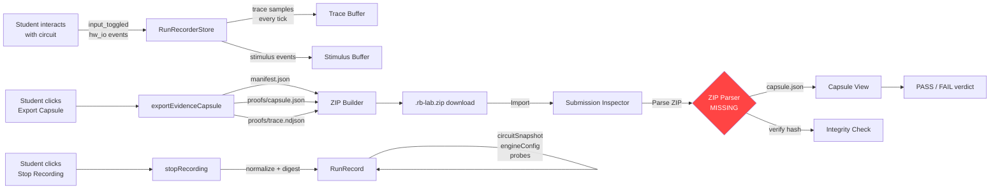
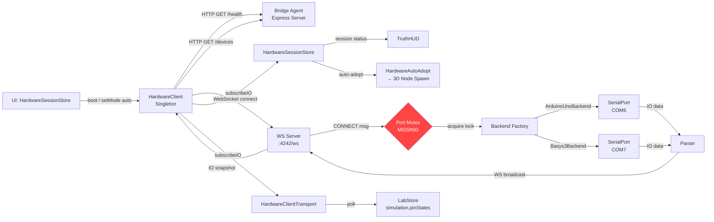
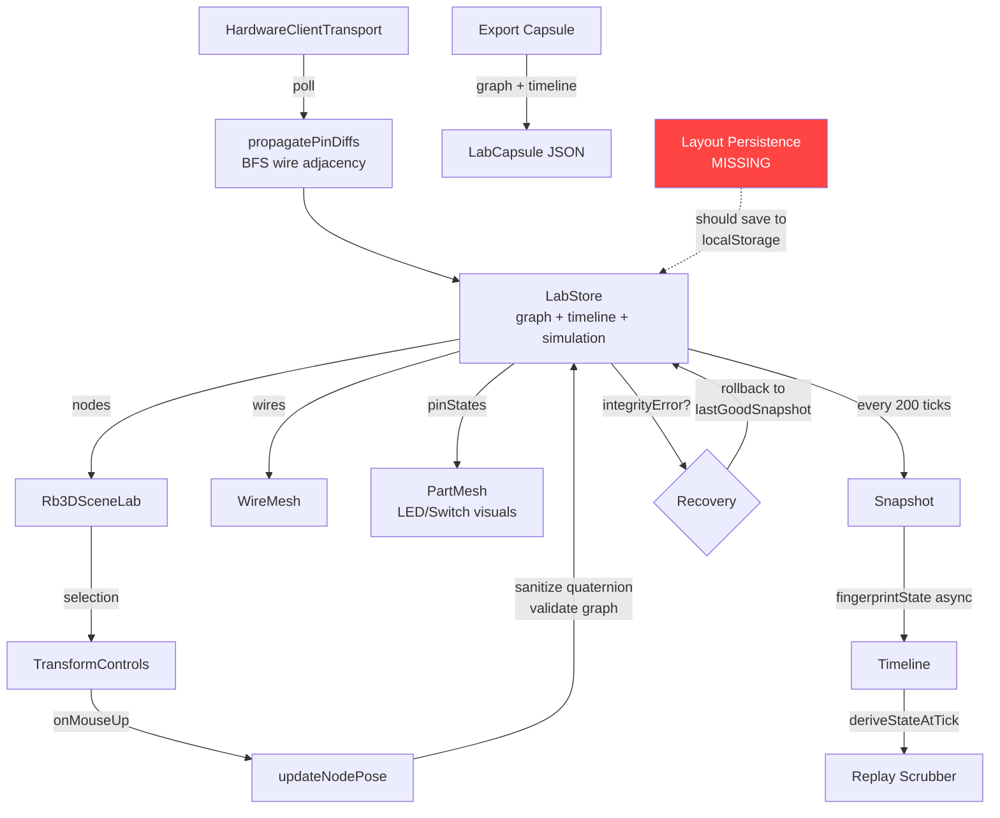

# RedByte OS Genesis — Ship-Grade System Map

## App Inventory

### Shell Apps (20 registered)

| App ID | Display Name | Package | Category |
|--------|-------------|---------|----------|
| terminal | Terminal | rb-apps | System |
| settings | Settings | rb-apps | System |
| files | Files | rb-apps | System |
| logic-playground | Logic Playground | rb-apps | **Flagship** |
| ece-lab | ECE 347 Lab | rb-apps | Educational |
| virtual-lab | Virtual Lab | rb-apps | Educational |
| app-store | App Store | rb-apps | System |
| welcome | Welcome | rb-apps | Onboarding |
| start-here | Start Here | rb-apps | Tutorial |
| launcher | Launcher | rb-apps | System |
| system-log | System Log | rb-apps | Debug |
| text-viewer | Text Viewer | rb-apps | Utility |
| logic-help | Logic Help | rb-apps | Help |
| user-manual | User Manual | rb-apps | Documentation |
| hardware-panel | Hardware Panel | rb-apps | FPGA |
| fpga-proof-viewer | FPGA Proof Viewer | rb-apps | Debug |
| lab-examiner | Lab Examiner | rb-apps | Instructor |
| instructor | Instructor Dashboard | rb-apps | Instructor |
| instructor-run-detail | Run Detail | rb-apps | Instructor |
| submission-inspector | Submission Inspector | rb-apps | Inspector |

### Workspace Packages (31 total)

**Core Logic**: rb-logic-core, rb-logic-view, rb-logic-adapter, rb-logic-3d, rb-analog-sim
**Shell/UI**: rb-shell, rb-theme, rb-tokens, rb-icons, rb-primitives, rb-windowing
**Hardware**: rb-protocol, rb-bridge-agent, rb-fpga-bridge, rb-fpga-bridge-contract (legacy)
**Crypto/Proof**: rb-fpga-signing, rb-fpga-proof-core, rb-fpga-grading
**Apps**: rb-apps (mega-package, 11 workspace deps)
**Tooling**: rb-fpga-toolchain, config, board-models
**Frontend**: playground, manual-site, studio, docs

## Core Services

### Recorder Service
- **Store**: `useRunRecorderStore` (packages/rb-apps/src/stores/runRecorderStore.ts)
- **Types**: `RunRecord`, `RunStimulusEvent`, `RunTraceSample` (packages/rb-apps/src/recording/runRecord.ts)
- **Utils**: digest, normalize, mismatch report (packages/rb-apps/src/recording/runRecordUtils.ts)
- **Modes**: idle → armed → recording → idle; idle → replaying → idle

### Evidence Export Service
- **Export**: `exportEvidenceCapsule()` (packages/rb-apps/src/utils/evidenceExport.ts)
- **Verify**: `verifyEvidenceBundle()` (packages/rb-apps/src/utils/verifyEvidence.ts)
- **Viewer Store**: `useEvidenceViewerStore` (packages/rb-apps/src/stores/evidenceViewerStore.ts)
- **Output**: `.rb-lab.zip` containing manifest.json + proofs/capsule.json + proofs/trace.ndjson

### Lab Runtime Grading
- **Evaluator**: `evaluateAtTick()` (packages/rb-logic-3d/src/lab-model/labEvaluator.ts)
- **Templates**: `VIRTUAL_LAB_TEMPLATES` (packages/rb-apps/src/apps/virtual-lab-templates.ts)
- **Check types**: digital_level, blink, serial_matches_pin
- **Output**: `GradeReport` with score 0-100, per-check results, evidence links

### Bridge Client/Server Protocol
- **Protocol Package**: @redbyte/rb-protocol (packages/rb-protocol/src/bridge.ts)
- **Bridge Agent**: Express + WS server (packages/rb-bridge-agent/src/index.ts)
- **Client Singleton**: HardwareClient (packages/rb-apps/src/services/hardwareClient.ts)
- **Session Store**: useHardwareSessionStore (packages/rb-apps/src/stores/hardwareSessionStore.ts)
- **Message Types**: PING, CONNECT, DISCONNECT, GET_PINS, SET_PINS, VERIFY_DEVICE, LIST_DEVICES, UPLOAD_SKETCH

## Zustand Store Map

| Store | Location | Determinism-Critical | Controls |
|-------|----------|---------------------|----------|
| useCircuitStore | rb-apps (lazy) | **YES** | Circuit nodes, connections, undo/redo, engine |
| useLabStore | rb-logic-3d/lab-model/store.ts | **YES** | Graph, timeline, snapshots, simulation, integrity |
| useRunRecorderStore | rb-apps/stores/runRecorderStore.ts | **YES** | Recording mode, stimulus, trace, replay, verification |
| useProbeStore | rb-apps (lazy) | **YES** | Oscilloscope probes, sampling |
| useOscilloscopeStore | rb-apps (lazy) | No | UI state: pause, time window, cursor |
| useHardwareSessionStore | rb-apps/stores/hardwareSessionStore.ts | No | Bridge status, device list, sessions |
| useFileSystemStore | rb-apps | No | Virtual filesystem, files, content |
| useWindowStore | rb-windowing | No | Window positions, z-index, focus |
| useLayoutStore | rb-apps (lazy) | No | Perspective, dock tabs, split mode |
| useViewStateStore | rb-apps | No | Selection, hover, focus, auto-probe |
| useChipStore | rb-apps (lazy) | No | Custom chip definitions |
| useHierarchyStore | rb-apps | No | Chip navigation stack |
| useThemeStore | rb-shell | No | Wallpaper, theme variant |
| useToastStore | rb-primitives | No | Toast notifications |
| useEvidenceViewerStore | rb-apps/stores/evidenceViewerStore.ts | No | Evidence bundle, verification status |

## Pipeline Diagrams

### Evidence Pipeline

### Hardware Pipeline

### 3D Lab Pipeline

